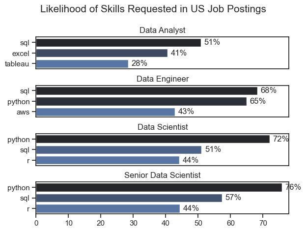
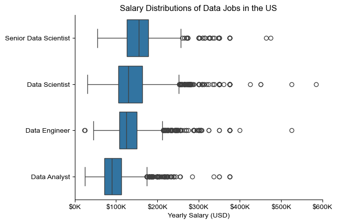
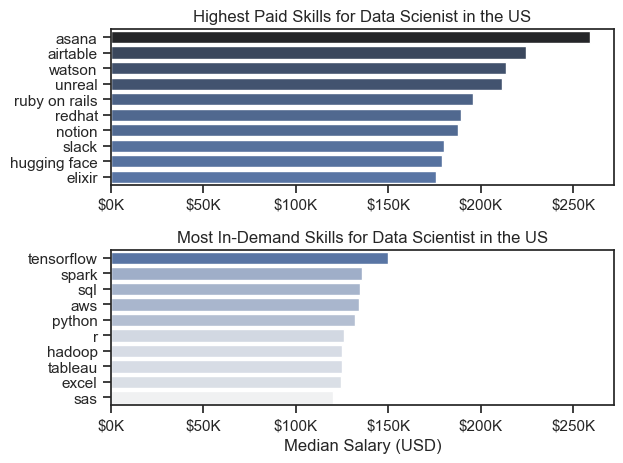
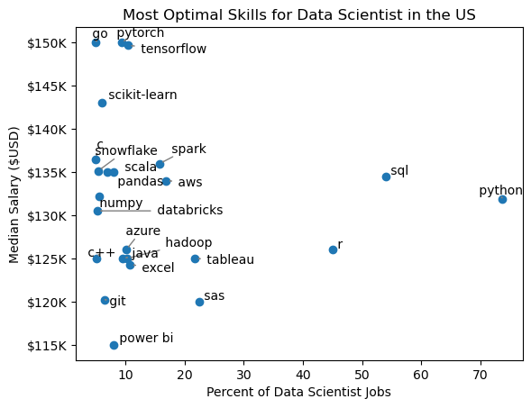
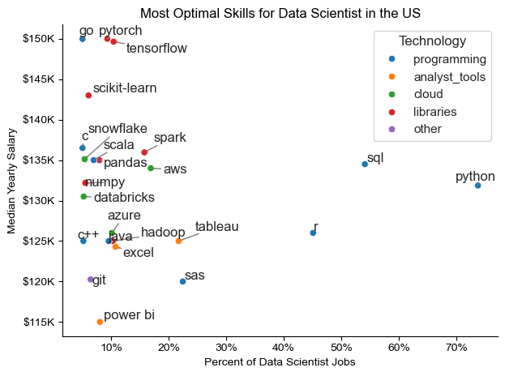

# Overview

Welcome to my analysis of the data job market, focusing on data Scientist roles. This project was created out of a desire to navigate and understand the job market more effectively. It delves into the top-paying and in-demand skills to help find optimal job opportunities for data analysts.


# The Questions

Below are the questions I want to answer in my project:

1. What are the skills most in demand for the top 4 most popular data roles?
2. How are in-demand skills trending for Data Scientist?
3. How well do jobs and skills pay for Data Scientist?
4. What are the optimal skills for data Scientist to learn? (High Demand AND High Paying) 

# Tools I Used

For my deep dive into the data analyst job market, I harnessed the power of several key tools:

- **Python:** The backbone of my analysis, allowing me to analyze the data and find critical insights.I also used the following Python libraries:
    - **Pandas Library:** This was used to analyze the data. 
    - **Matplotlib Library:** I visualized the data.
    - **Seaborn Library:** Helped me create more advanced visuals. 
- **Jupyter Notebooks:** The tool I used to run my Python scripts which let me easily include my notes and analysis.
- **Visual Studio Code:** My go-to for executing my Python scripts.
- **Git & GitHub:** Essential for version control and sharing my Python code and analysis, ensuring collaboration and project tracking.

# Data Preparation and Cleanup

This section outlines the steps taken to prepare the data for analysis, ensuring accuracy and usability.

## Import & Clean Up Data

I start by importing necessary libraries and loading the dataset, followed by initial data cleaning tasks to ensure data quality.

```python
# Importing Libraries
import ast
import pandas as pd
import seaborn as sns
from datasets import load_dataset
import matplotlib.pyplot as plt  

# Loading Data
dataset = load_dataset('lukebarousse/data_jobs')
df = dataset['train'].to_pandas()

# Data Cleanup
df['job_posted_date'] = pd.to_datetime(df['job_posted_date'])
df['job_skills'] = df['job_skills'].apply(lambda x: ast.literal_eval(x) if pd.notna(x) else x)
```

## Filter US Jobs

To focus my analysis on the U.S. job market, I apply filters to the dataset, narrowing down to roles based in the United States.

```python
df_US = df[df['job_country'] == 'United States']

```

# The Analysis

Each Jupyter notebook for this project aimed at investigating specific aspects of the data job market. Here’s how I approached each question:

## 1. What are the most demanded skills for the top 4 most popular data roles?

To find the most demanded skills for the top 4 most popular data roles. I filtered out those positions by which ones were the most popular, and got the top 5 skills for these top 3 roles. This query highlights the most popular job titles and their top skills, showing which skills I should pay attention to depending on the role I'm targeting. 

View my notebook with detailed steps here: [2_Skill_Demand](2_Skill_Demand.ipynb).

### Visualize Data

```python
fig, ax = plt.subplots(len(job_titles), 1)


for i, job_title in enumerate(job_titles):
    df_plot = df_skills_perc[df_skills_perc['job_title_short'] == job_title].head(5)[::-1]
    sns.barplot(data=df_plot, x='skill_percent', y='job_skills', ax=ax[i], hue='skill_count', palette='dark:b_r')

plt.show()
```

### Results



*Bar graph visualizing the salary for the top 4 data roles and their top 3 skills associated with each.*

### Insights:

- ✅ SQL is the most consistently requested skill across all roles, especially for Data Engineers (68%) and Analysts (51%).
- 🐍 Python dominates Data Science roles, peaking at 76% for Senior Data Scientists.
- 📊 Excel and Tableau are key for Data Analysts, but rarely appear in other roles.
- ☁️ AWS is notable for Data Engineers (43%), showing the importance of cloud skills in engineering.
- 📈 R is equally valued (44%) for both Data Scientist levels, but less so elsewhere.
- 🔍 The trend shows increasing demand for Python and SQL as roles become more senior and technical.

## 2. How are in-demand skills trending for Data Scientist?

To find how skills are trending for Data Scientist, I filtered data analyst positions and grouped the skills by the month of the job postings. This got me the top 4 skills of data analysts by month, showing how popular skills were throughout .

View my notebook with detailed steps here: [3_Skills_Trend](3_Skills_Trend.ipynb).

### Visualize Data

```python

from matplotlib.ticker import PercentFormatter

df_plot = df_DA_US_percent.iloc[:, :5]
sns.lineplot(data=df_plot, dashes=False, legend='full', palette='tab10')

plt.gca().yaxis.set_major_formatter(PercentFormatter(decimals=0))

plt.show()

```

### Results

  
*Bar graph visualizing the trending top skills for data Scientist in the US .*

### Insights:

- 🐍 Python stays on top all year—most in-demand skill for Data Scientists.
- 🧡 SQL holds steady, consistently second in job mentions.
- 📉 R shows mild fluctuation, but remains relevant throughout.
- 🔻 Tableau lags behind, with lowest demand and minimal growth.
- 📊 Overall, Python + SQL combo dominates, ideal for long-term career prep.


## 3. How well do jobs and skills pay for Data Scientist?

To identify the highest-paying roles and skills, I only got jobs in the United States and looked at their median salary. But first I looked at the salary distributions of common data jobs like Data Scientist, Data Engineer, and Data Analyst, to get an idea of which jobs are paid the most. 

View my notebook with detailed steps here: [4_Salary_Analysis](4_Salary_Analysis.ipynb).

#### Visualize Data 

```python
sns.boxplot(data=df_US_top6, x='salary_year_avg', y='job_title_short', order=job_order)

ticks_x = plt.FuncFormatter(lambda y, pos: f'${int(y/1000)}K')
plt.gca().xaxis.set_major_formatter(ticks_x)
plt.show()

```

#### Results

  
*Box plot visualizing the salary distributions for the top 4 data job titles.*

#### Insights

- 💼 Senior Data Scientists earn the most, with wide salary variation and outliers crossing $300K+.
- 📊 Data Scientists and Data Engineers have similar medians, but Engineers show a tighter salary range.
- 📉 Data Analysts earn the least, with a narrow spread and fewer high-end outliers.
- 🎯 Higher roles = more salary volatility, suggesting negotiation and specialization matter more at senior levels.


### Highest Paid & Most Demanded Skills for Data Scientist

Next, I narrowed my analysis and focused only on data analyst roles. I looked at the highest-paid skills and the most in-demand skills. I used two bar charts to showcase these.

#### Visualize Data

```python

fig, ax = plt.subplots(2, 1)  

# Top 10 Highest Paid Skills for Data Scientist
sns.barplot(data=df_DA_top_pay, x='median', y=df_DA_top_pay.index, hue='median', ax=ax[0], palette='dark:b_r')

# Top 10 Most In-Demand Skills for Data Scientist')
sns.barplot(data=df_DA_skills, x='median', y=df_DA_skills.index, hue='median', ax=ax[1], palette='light:b')

plt.show()

```

#### Results
Here's the breakdown of the highest-paid & most in-demand skills for data analysts in the US:


*Two separate bar graphs visualizing the highest paid skills and most in-demand skills for data analysts in the US.*

#### Insights:

🧭 Chart 1: Highest Paid Skills — Hidden Gems 💎

- 🧠 asana, airtable, watson → Project tools & AI platforms
- 🎮 unreal, ruby on rails → Game dev & web frameworks
- 🧰 notion, slack, hugging face → Workflow + ML tool

📈 Chart 2: Most In-Demand Skills — Core Stack 🔧

- 🐍 Python, SQL, AWS → Must-have for 80%+ roles
- 🔬 TensorFlow, Spark, R → ML + Big Data essentials
- 📊 Excel, Tableau, SAS → Analyst tools, lower pay but high visibilit


## 4. What are the most optimal skills to learn for Data Scientist?

To identify the most optimal skills to learn ( the ones that are the highest paid and highest in demand) I calculated the percent of skill demand and the median salary of these skills. To easily identify which are the most optimal skills to learn. 

View my notebook with detailed steps here: [5_Optimal_Skills](image/most_optimal_skills.png).

#### Visualize Data

```python
from adjustText import adjust_text
import matplotlib.pyplot as plt

plt.scatter(df_DA_skills_high_demand['skill_percent'], df_DA_skills_high_demand['median_salary'])
plt.show()

```

#### Results

    
*A scatter plot visualizing the most optimal skills (high paying & high demand) for data Scientist in the US.*

#### Insights:

- 💰 Go, PyTorch, and TensorFlow offer top salaries (~$150K) but appear in fewer job postings.
- 🐍 Python is the most requested skill (~70%), with a solid median salary (~$135K).
- 🧡 SQL ranks second in demand (~50%), slightly lower in salary than Python.
- 📉 Skills with niche demand often pay more, but limit job opportunities.
- 🔍 High-demand skills like Python/SQL = job security, even if salary is mid-tier.
- 🧠 AI/ML frameworks (PyTorch, TensorFlow) = high-value specialization, ideal for senior roles.
- 📊 R and Tableau offer moderate demand and salary, useful but not premium.
- 🎯 For career strategy: master Python + SQL, then specialize in ML tools for salary boost

### Visualizing Different Techonologies

Let's visualize the different technologies as well in the graph. We'll add color labels based on the technology (e.g., {Programming: Python})

#### Visualize Data

```python
from matplotlib.ticker import PercentFormatter

# Create a scatter plot
scatter = sns.scatterplot(
    data=df_DA_skills_tech_high_demand,
    x='skill_percent',
    y='median_salary',
    hue='technology',  # Color by technology
    palette='bright',  # Use a bright palette for distinct colors
    legend='full'  # Ensure the legend is shown
)
plt.show()

```

#### Results

  
*A scatter plot visualizing the most optimal skills (high paying & high demand) for data scientists in the US with color labels for technology.*

#### Insights:

skills into 3 zones based on the chart:

- Zone A: High Salary, Low Demand → Go, PyTorch, TensorFlow
- Zone B: Balanced Salary & Demand → AWS, Spark, Pandas, Snowflake
- Zone C: High Demand, Lower Salary → Python, SQL, Excel, Tableau

A combo that balances job access + salary boost:

- 🔧 Base Layer (must-have): Python + SQL
- ☁️ Infra Layer (cloud/data): AWS + Snowflake
- 🤖 ML Layer (premium): PyTorch + TensorFlow

## 📘 What I Learned

Through visual analysis of US data science job trends, I identified high-demand and high-paying skills across roles like Data Analyst, Engineer, and Scientist. I learned that Python and SQL are foundational, appearing in most job postings, while ML libraries (e.g., TensorFlow, PyTorch) and cloud tools (e.g., AWS, Snowflake) offer salary boosts despite niche demand. I also discovered that salary distribution widens with seniority, and tools like Airtable, Hugging Face, and Asana—though less common—can unlock premium compensation. This insight shaped my SkillScope roadmap, helping me prioritize core skills first, then layer in high-value specializations for career growth

# Insights

This project provided several general insights into the data job market for data professionals:

- **Core Skills vs. Specialized Skills**: Foundational tools like Python and SQL dominate job postings, ensuring broad employability, while niche skills such as TensorFlow, PyTorch, and Go command higher salaries despite lower demand.  
- **Salary Distribution by Role**: Senior Data Scientists earn the highest and most variable salaries, while Data Analysts remain at the lower end with narrower ranges.  
- **Demand vs. Value Trade-Off**: High-demand skills provide job security, but specialized libraries and cloud tools unlock premium compensation, making a hybrid skill stack the most strategic.  
- **Dynamic Market Trends**: Skill demand shifts over time, emphasizing the need for continuous learning and adaptation to stay competitive.  
- **Economic Prioritization**: Understanding which skills balance both demand and salary potential helps professionals maximize career growth and economic returns.  


# Challenges I Faced

This project was not without its challenges, but it provided good learning opportunities:

- **Data Inconsistencies**: Handling missing or inconsistent data entries requires careful consideration and thorough data-cleaning techniques to ensure the integrity of the analysis.
- **Complex Data Visualization**: Designing effective visual representations of complex datasets was challenging but critical for conveying insights clearly and compellingly.
- **Balancing Breadth and Depth**: Deciding how deeply to dive into each analysis while maintaining a broad overview of the data landscape required constant balancing to ensure comprehensive coverage without getting lost in details.


# Conclusion

This exploration into the data science job market has been highly insightful, revealing the balance between skill demand, salary potential, and career progression. The findings highlight how foundational skills like Python and SQL ensure employability, while specialized tools such as TensorFlow, PyTorch, and cloud platforms unlock higher compensation and advanced opportunities. These insights not only strengthen my understanding of industry dynamics but also provide clear guidance for building a strategic skill stack. As the market continues to evolve, ongoing analysis and continuous learning will remain essential for staying competitive. This project serves as a strong foundation for future explorations and reinforces the importance of adaptability in the data field.